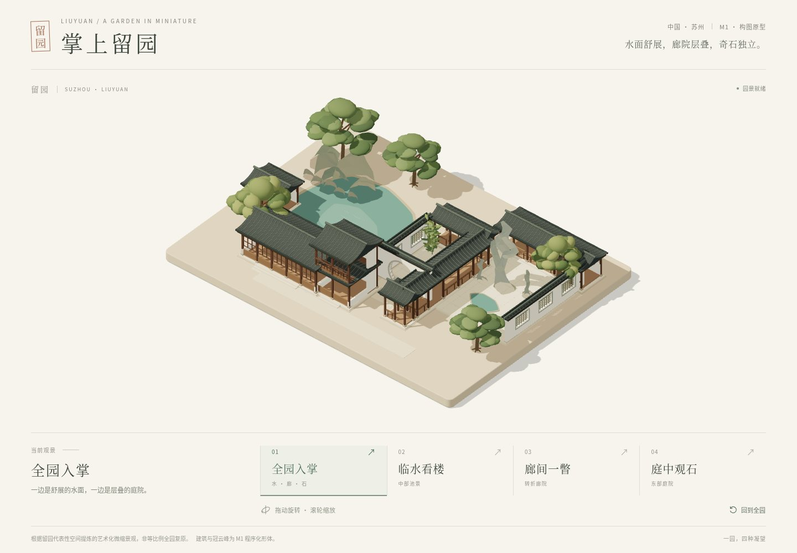
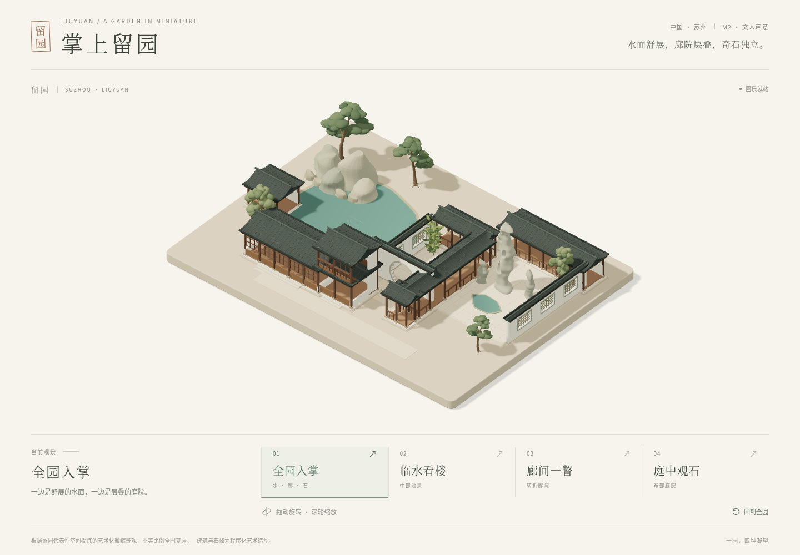
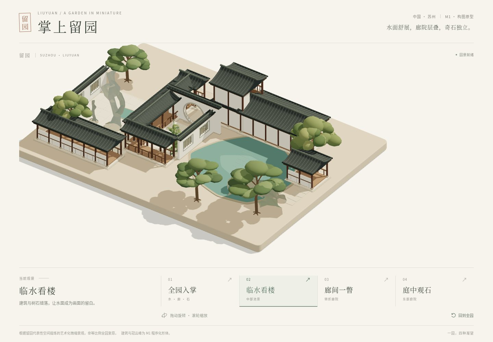
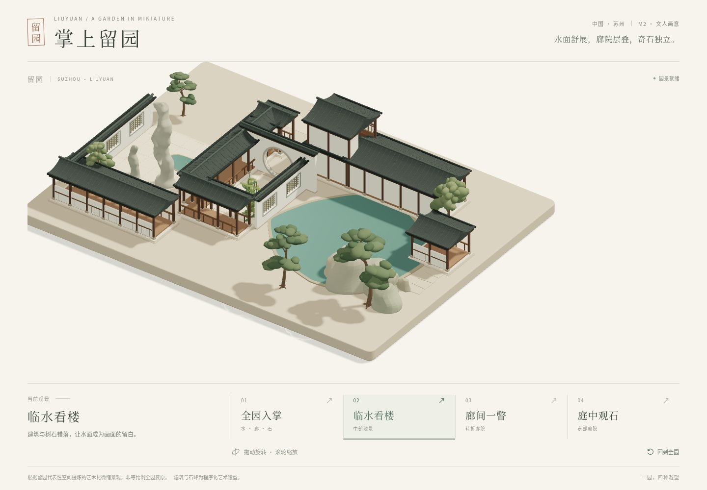
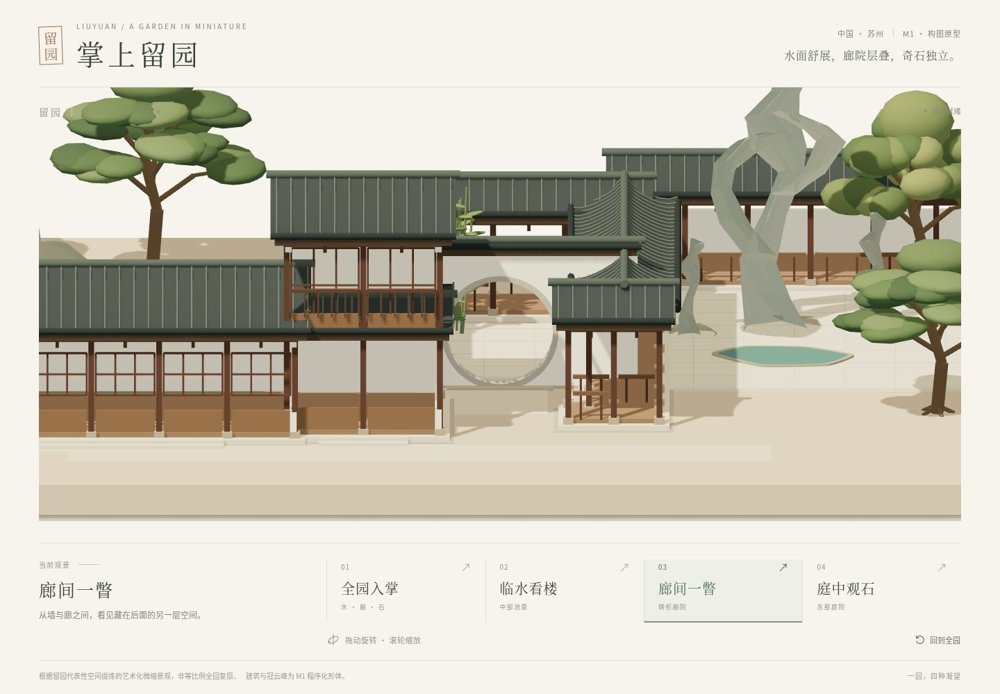
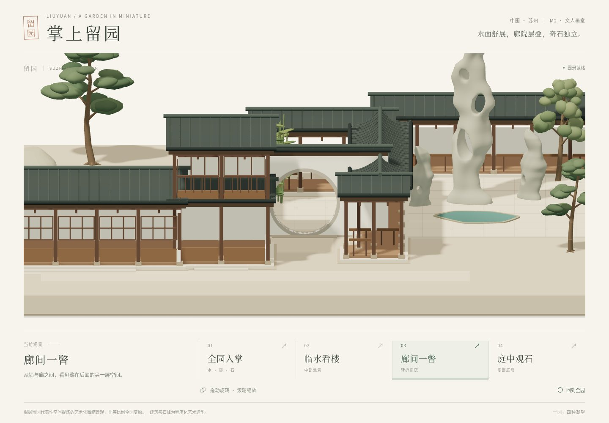
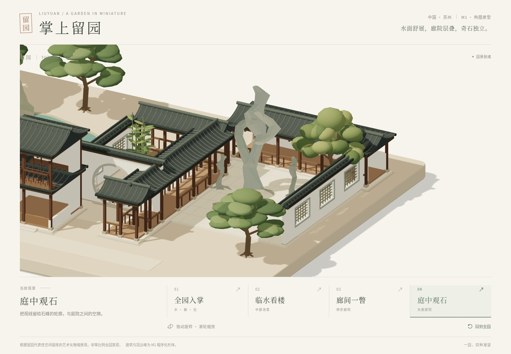
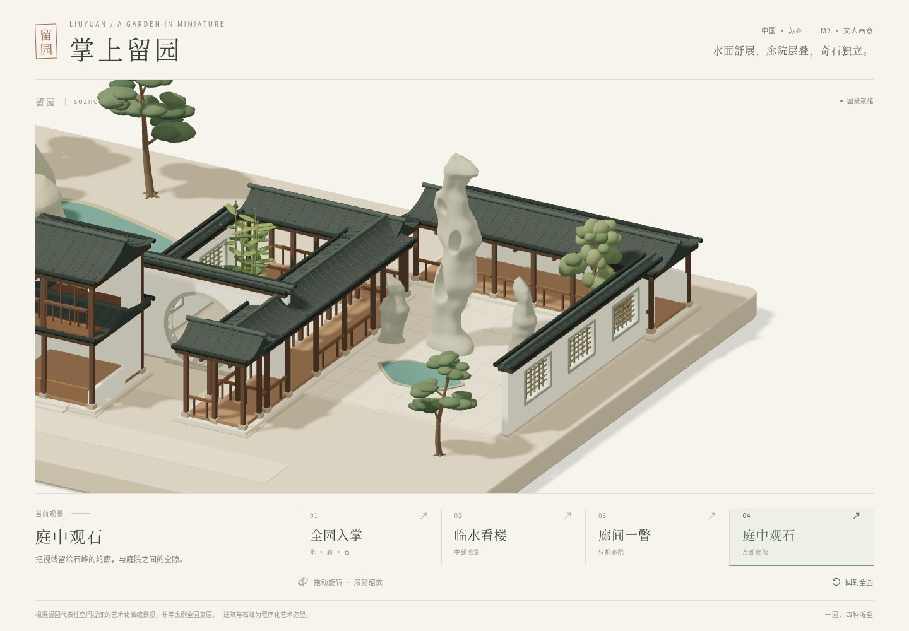
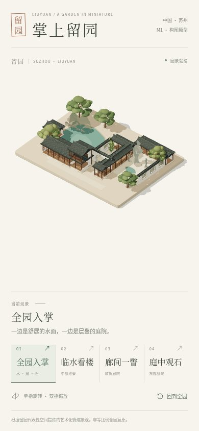
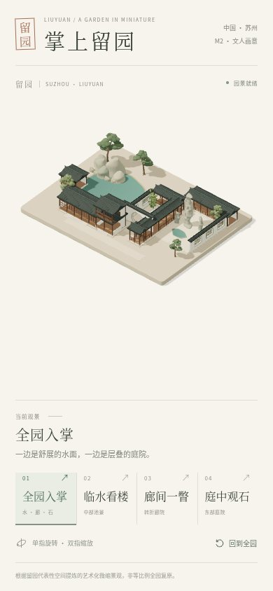

# 留园 M2 · 文人画意美术样板第一轮

完成日期：2026-10-03。用户在已交付的 M1 上反馈“更艺术”，并确认继续按文人画意的手作沙盘方向打磨。本轮调整构图比例、石峰、树姿、水色、屋面与柔光，保留原来的四个机位和五张对照条件。造型为艺术化估计，未宣称实测复原或最终美术验收。

## 范围与造型

全部源码、依赖、测试与交付位于 `suzhou-gardens/liuyuan/`。未修改上层任务书或其他园林，也未在上层初始化应用。沿用原 React / TypeScript / Vite / R3F / Drei / Three.js 依赖和锁文件。先读取已有 Site 的源版本，再在本目录忽略的 `.sites-runtime/source` 中完成更新，同步回应用目录。

- 水面略放宽；涵碧山房与明瑟楼的进深、高度、檐口略收，降低屋面占比。降低瓦线对比与厚度，让灰瓦成为连续安静的体量。
- 冠云峰由大折面环状占位变为连续隐式场雕刻网格，主峰保留瘦高、不对称轮廓与三处真实贯穿孔洞。两块配峰采用独立宽实轮廓，各有一个低位透孔。
- 松树采用侧倾、转折、渐细的树干和横出枝，不等云片叶群之间有空隙。西北冠幅恢复适度密度，东院树冠较低、较小，让主石清晰。
- 西山采用连贯收放的岩体与克制棱面。审图发现原岩体面朝内，曾显示远侧背面而形成薄片感；已修正侧面和端盖的三角朝向，新增闭合体积回归。
- 青绿水面以连续顶点色表现轻微色差，去掉明显硬边色块；暖白墙、灰瓦和石色统一为哑光。单个方向光配柔化阴影，保持静止与按需渲染。

稳定语义 ID、建筑 body/roof 分组、对象原点、相机位置/目标/正交范围、固定种子 `20261003` 均保留。没有新增远程素材、模型下载或运行时 API。准确性与来源见 [资产台账](../../ASSET_SOURCES.md)。

## 实际验证

环境：Node **24.19.0**、npm **11.9.0**，Chromium **151.0.7922.173**，ANGLE / Vulkan / SwiftShader 软件 WebGL。项目要求 Node **22.12+** / npm **10+**。

| 命令 | 实际结果 |
| --- | --- |
| `npm run dev -- --port 5173 --strictPort` | Vite 启动，实际页面与测试可访问 |
| `npm run typecheck` | 最终退出 0 |
| `npm run test` | 最终退出 0，**15/15**，没有 skip |
| `npm run build` | 最终退出 0，产出静态 `dist/` |
| `npm run test:e2e` | 退出 0，完整 **7/7** 浏览器检查，约 3.6 分钟 |
| `npm run test:e2e -- --grep '真实渲染四个机位'` | 西山朝向修正后追加最终五机位复查，退出 0，**1/1**，约 51 秒 |
| `npm run preview -- --port 4174 --strictPort` | 最终构建产物预览实际启动 |
| `node /tmp/liuyuan-m2-production-check.mjs` | 临时真实 Playwright 验收，退出 0；HTTP **200**、切到观石并复位，页面异常 **0** |

完整 7 项检查覆盖真实非空 canvas、四种不同构图、预设切换、连续请求、手动中断、复位、滚轮缩放边界、横竖屏 resize、键盘、reduced motion、CDP 单指旋转/双指缩放及 WebGL 失败反馈。该完整检查在最后的西山表面朝向修正前执行；修正仅涉及岩体三角朝向，之后重跑了完整单元测试、类型检查、构建、五机位真实渲染与生产产物检查。未把筛选复查写成第二次完整 7 项运行。

新增几何检查直接使用真实网格与 Raycaster：主峰三孔和配峰低孔能够贯穿，孔侧实体可命中；固定种子重复构建一致、法线有限、高度与三角预算合法。西山回归先在缺陷几何上失败（有向体积约 -40.34），修正后通过；没有放宽检查或屏蔽失败。原月洞穿透与水面不被池岸遮挡的回归仍通过。

最终五机位检查没有 JavaScript 页面异常，没有远程运行时资源请求。以下是实际绘制统计，不是手机帧率结论：

| 画面 | draw calls | 三角形 | zoom |
| --- | ---: | ---: | ---: |
| 桌面 overview | 74 | 162,487 | 21.16129 |
| 桌面 waterside | 74 | 162,487 | 27.33333 |
| 桌面 corridor | 65 | 145,943 | 59.63636 |
| 桌面 guanyun | 67 | 151,691 | 46.85714 |
| 手机 overview | 74 | 162,487 | 8.31818 |

石峰自身：主峰 22,036 三角，西配峰 7,740、东配峰 7,728。初始化生成后只保留最终几何，临时采样资源释放；材质复用，卸载清理，无逐帧重建。

## 同机位真实截图对照

桌面 **1440×1000**、手机 **390×844**、**DPR=1**，JPEG 质量 **84**。最终截图均来自实际应用、相机与渲染稳定后截取，已逐张查看。M1 原截图保留，未覆盖；相机配置未变。M2 五张合计约 464 KiB。

| 机位 | M1 | M2 |
| --- | --- | --- |
| 全园入掌 |  |  |
| 临水看楼 |  |  |
| 廊间一瞥 |  |  |
| 庭中观石 |  |  |
| 竖屏全园 |  |  |

人工检查：整体有左密右疏的关系；临水画面水面舒展，树枝之间能看见岸线；廊间月洞保持可透视；东院的低配峰和小树让主峰独立。局部机位仍按 M1 构图裁切无关区域，未换机位隐藏变化。石峰保留柔润手作感，后续可继续根据实物参考与用户审美反馈调整。

## 限制与运行

建筑细部、冠云峰孔洞位置、岸线、比例及树姿均为艺术化处理，尚未完成实物多角度参考匹配。手机整体画面石峰细节较小，需切换观石或缩放。**未验证** Safari/iOS、Android 真机、真实 GPU 帧率、发热、长时资源趋势或网络加载性能；软件 WebGL 和触摸模拟不能替代真机。

构建仍有 Vite chunk 超过 500 kB 的体积警告：JavaScript 约 **1,074 kB**，gzip 约 **299 kB**。未屏蔽警告，后续性能打磨可分包。无 M3 屋顶抬升、第一人称或其他园林功能。

```bash
cd suzhou-gardens/liuyuan
npm ci
npm run dev
```

默认访问 `http://localhost:5173`。鼠标拖动旋转、滚轮缩放；手机单指旋转、双指缩放。四个观景点与“回到全园”可键盘操作。生产预览：`npm run build` 后 `npm run preview`，默认 4173。

按已授权的 ChatGPT Sites 托管请求更新同一私有站点，沿用 [掌上留园](https://liuyuan-miniature-m1.jggagi.chatgpt.site) 地址及 `.openai/hosting.json` 身份；不扩大访问范围。具体发布回执保存于忽略的 `.sites-runtime/`，不将凭据写入代码。
