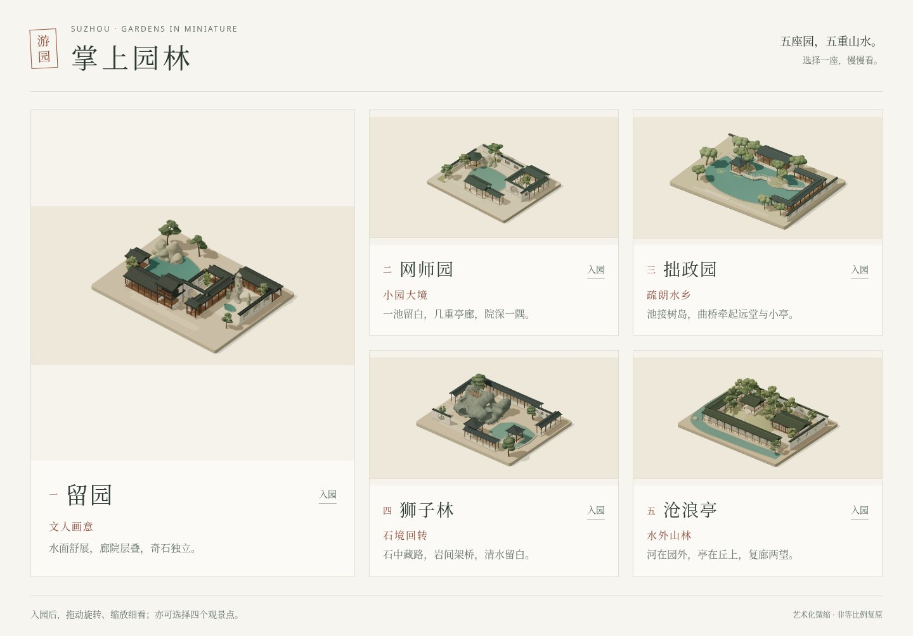
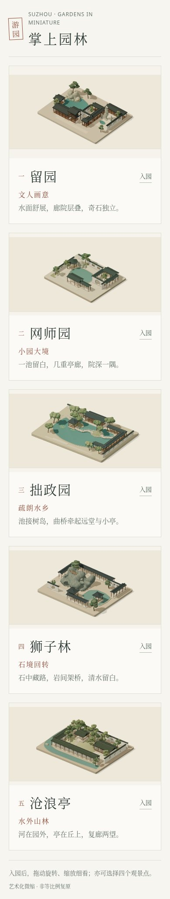

# 五园入口 · 本轮画面与手机打磨

五张缩略图已更新为五园最终生产构建的真实全园 WebGL 画布。园景光色、构图与各园页面一致；入口保持既有五个 Site 地址。园林仍各自安装、运行、构建与发布，本入口仅导航。

## 实际检查

Chromium 151.0.7922.173、本地静态 HTTP 服务、DPR 1；八组检查全部通过：

1. HTTP 200、五个准确链接与五张真实图片完整加载。
2. 1440×1000 桌面五园同屏，无横向溢出。
3. 五张卡片键盘可聚焦、焦点可见，Enter 请求正确地址。
4. 五张卡片单页点击请求各自既有 Site 地址。
5. 390×844 手机布局无横向溢出，五园均可滚动到达。
6. 320×844 窄屏同样无横向溢出，卡片可操作。
7. 200% 浏览器等效放大无横向溢出。
8. 单独干净本地页面脚本与控制台异常为 0。

跨站跳转在本地拦截后核对地址；没有据此声称已验证登录后的跨站游园、国内网络或真实手机性能。各园独立检查为 61 项单元与 40 项完整浏览器验收，另完成最终产物的四个手机视角、窄屏、短横屏、根字体 200% 与绘图 DPR 检查。

真实数据见 [check-results.json](check-results.json)。五园已沿用现有私有身份发布成功，确切源提交、版本与部署记录见 [garden-deployments.json](garden-deployments.json)。来源构建与缩略图指纹见 [thumbnail-provenance.json](thumbnail-provenance.json)。

## 真实截图

下图直接来自浏览器，未使用生成图或后期处理；桌面 1440×1000、手机 390×844、DPR 1、JPEG 质量 86。

## 运行与分享

在本目录执行 `python3 -m http.server 4180 --bind 127.0.0.1 --directory dist`，本地打开 `http://127.0.0.1:4180/`。卡片使用既有 Site 权限。

新版静态包的五园同站点入园、子路径刷新、真实渲染、观景切换、复位和返回全部通过，脚本异常、失败请求与外部请求均为 0；实录见 [cloudbase-check-results.json](cloudbase-check-results.json)。

面向国内朋友的单域名静态包与上传步骤见 [CloudBase 说明](../../CLOUDBASE.md)。本轮不改变访问范围；CloudBase 新版需在账户控制台替换上传。
