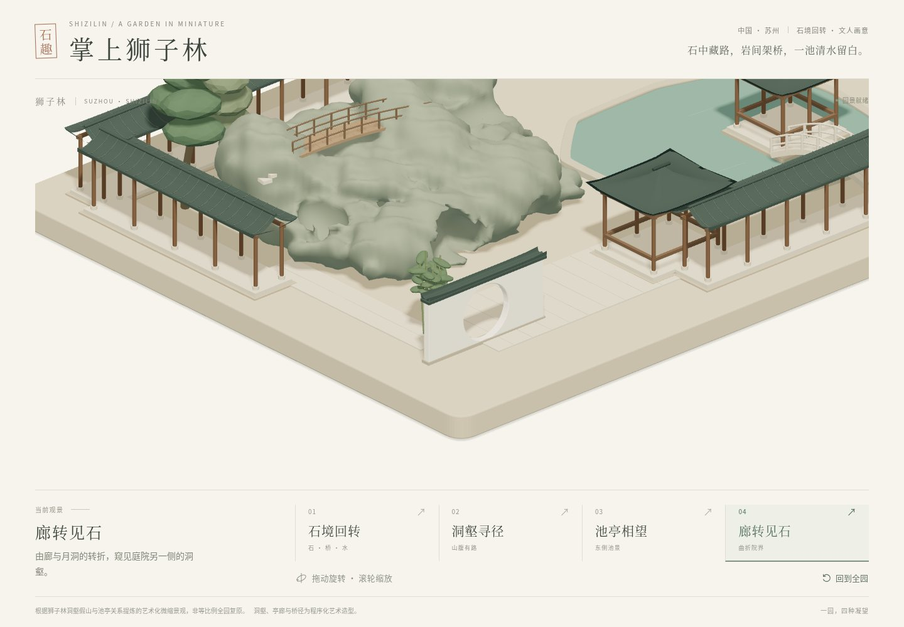
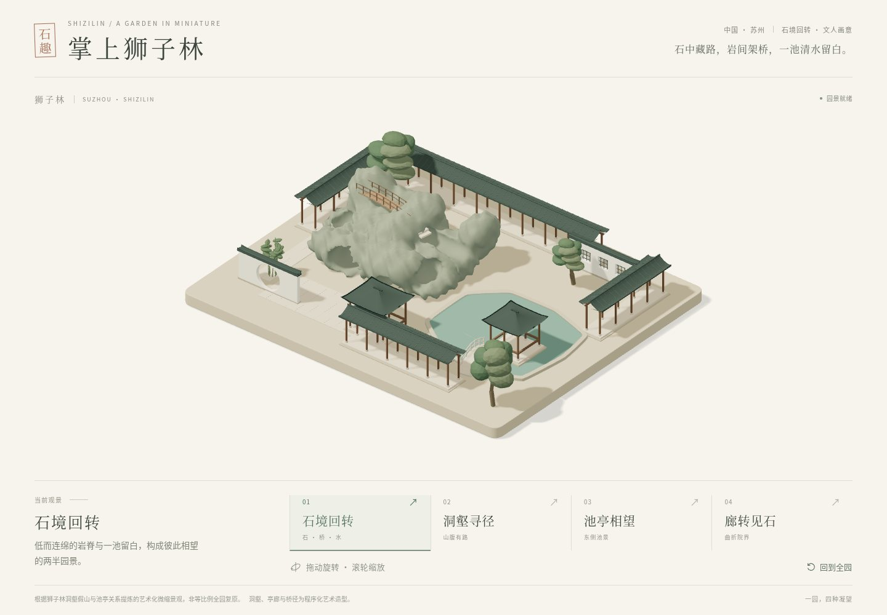
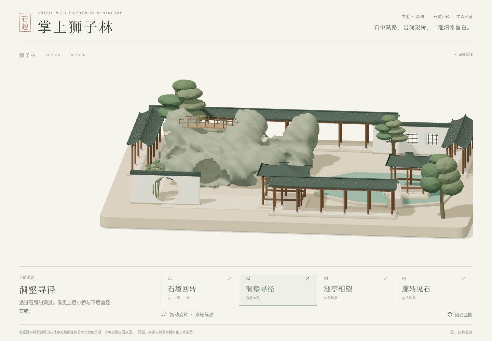
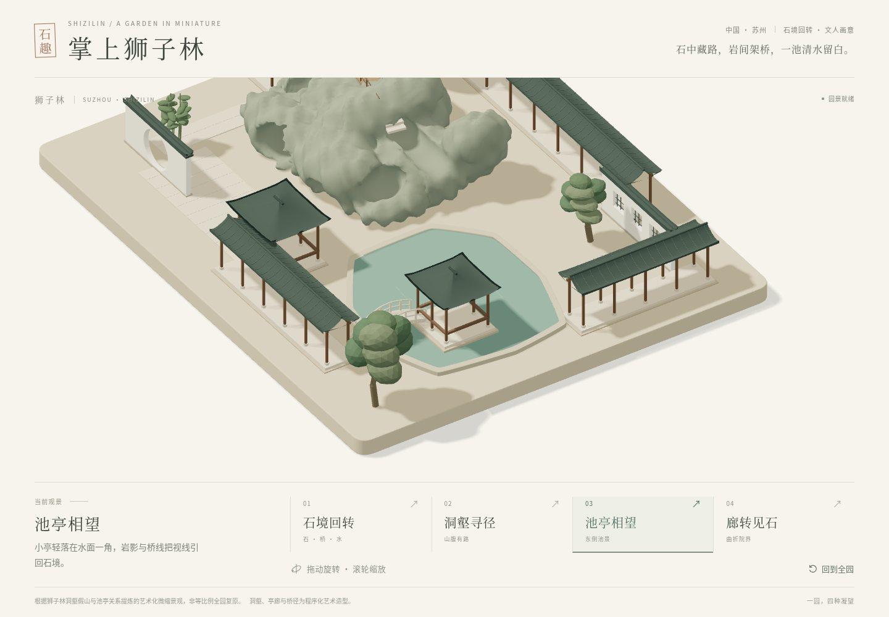
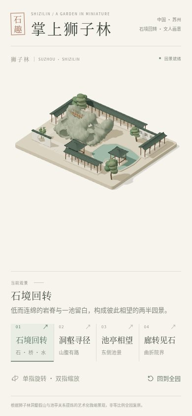

# 狮子林 M1 艺术微缩交付记录

日期：2026-10-04。用户明确要求完成 GitHub 清单中五座苏州园林，并沿用 ChatGPT Site。本园按自己的规格独立实现，包含四个不同的正交观景机位、旋转缩放、一键复位、响应式界面和 WebGL 失败反馈。

连续洞壑与岩上桥构成主体，池景与折廊位于两侧；观石机位显示真实孔洞。

## 实际检查

环境：Node 24.19.0 / npm 11.9.0，Chromium 151.0.7922.173，ANGLE Vulkan SwiftShader，DPR=1。依赖按本园锁文件 `npm ci --no-audit --no-fund --offline` 实际独立安装。没有跨园 import 或链接依赖。

| 检查 | 实际结果 |
|---|---|
| `npm run typecheck` | 退出 0 |
| `npm test` | **9/9** 通过，没有 skip |
| `npm run build` | 退出 0，生成静态 dist |
| `npm run test:e2e` | **7/7** 完整通过，没有 skip |
| 实际开发服务器 | E2E 自动启动 Vite，端口 5177 |
| 截图 | 真实 canvas，四桌面 1440×1000＋手机 390×844；JPEG 质量84 |

完整 E2E 包含真实非空画面和四机位位置验证、快速切换/手动中断/复位、滚轮两端限制、横竖屏 resize、减少动态效果与键盘、CDP 单指旋转/双指缩放、WebGL 不可用反馈。截图检查同时要求有效画面差异与真实几何绘制；正常渲染用例不使用 mock 场景。截图阶段页面异常 0，无远程运行时请求。

固定种子重复构建一致，语义 ID 与观景引用有效，全部最终几何和共享材质幂等释放。场景初始化只生成一次，不在每帧重建。模型实测 **19 个语义对象、40 个网格、98,586 个三角形**，此数字为全部模型遍历，不等同每机位实际可见绘制量或真机帧率。

人工审图后将池边树移向前侧边缘，让池亭四根柱与桥线清楚可见；随后重跑类型、单元、构建与完整7项E2E。边界检查使用最终模型的真实 Box3，树冠仍在声明范围内。

## 真实截图

### desktop-corridor

### desktop-overview

### desktop-rockery

### desktop-waterside

### mobile-overview

## 限制与来源

本作品是程序化原创艺术造型。园名及代表建筑名称用于空间主题，不声称已验证尺寸、方位、游线或建筑形制。未下载或再发布外部照片、纹理、字体或模型；参考入口的待核对状态见 [REFERENCES](../../REFERENCES.md)。

未验证 Safari、iOS/Android 真机、真实 GPU 帧率/发热或长时资源趋势。Vite 仍提示 JavaScript chunk 大于500kB；未隐藏该警告。首次加载与真机性能留待后续优化。本轮没有后端、导航、第一人称或屋顶抬升。

## 运行与托管

按 [README](../../../README.md) 在本园独立安装、开发和构建；`npm run preview -- --port 4173 --strictPort` 查看构建产物。ChatGPT Site 地址：[狮子林](https://shizilin-miniature.jggagi.chatgpt.site)，保持所有者私有访问。

发布流程把本园源码推送到自己的 Site 源仓库，从同一完整 commit 构建 dist 并打包 `.openai/hosting.json` 与 dist，再保存版本并发布。实际发布回执、短期凭据和临时日志放在忽略的 `.sites-runtime/`；凭据不会进入 GitHub 或静态页面。
