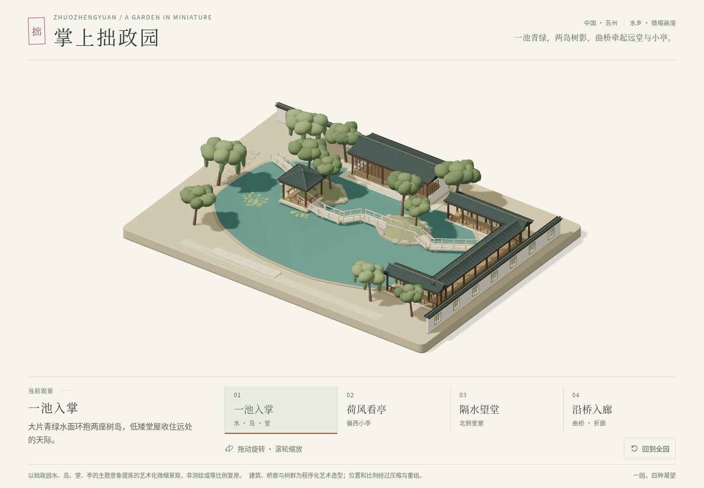
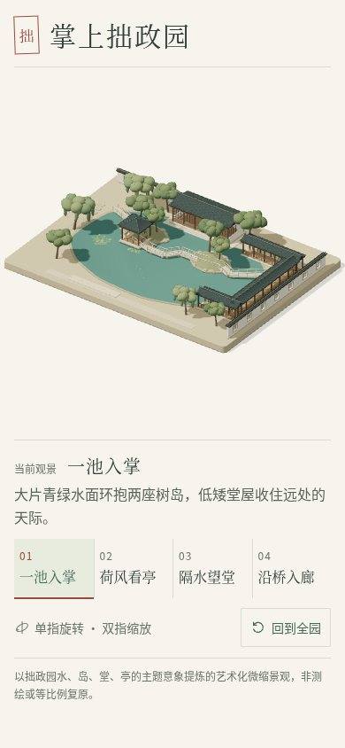
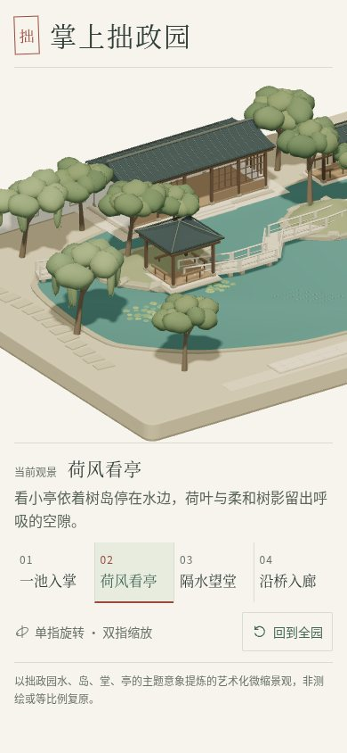
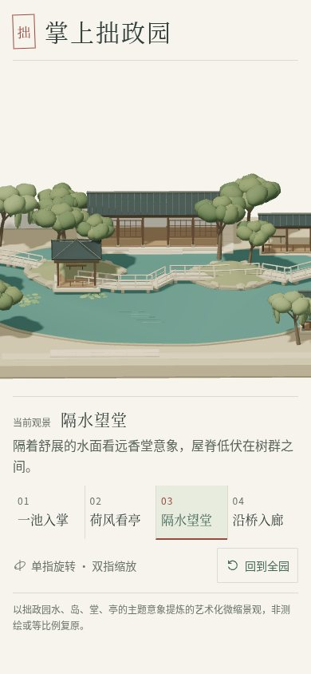
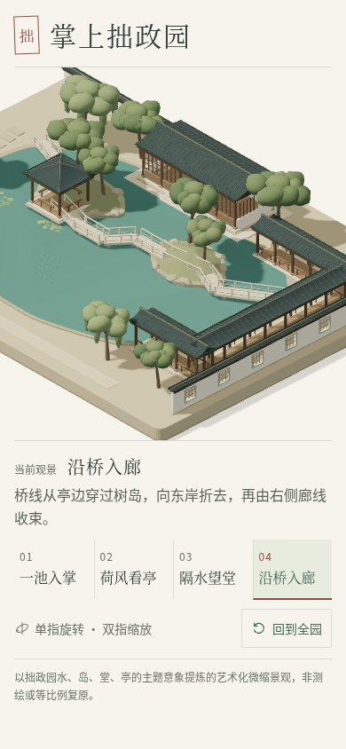

# 拙政园 · 画面与手机体验打磨

用户明确选择继续打磨五园画面与手机体验。本报告只记录本园；既有 M1/M2 报告与原截图保留。空间、构件与名称依然是艺术化提炼，不声明测绘复原或实物形制已经核对。

## 改动与原因

- 减少环境补光，调整暖光与冷灰补色，让瓦、木、石的明暗更可读；水与树色保持低饱和，并按本园主题调整。没有增加实时反射、后期特效或连续动画。
- 手机全景使用整屏宽度，仍保留原来的完整模型包络；三个局部观景点使用本园独立的窄屏构图参数。桌面与短横屏保留宽幅视野。预设转场期间 resize 或 reduced-motion 变化会立即恢复所选机位及新尺寸的缩放；手动方向与相对缩放仍被保留。
- 以朱印、墨色与更清晰的文字延续画册感。减少重复标题与就绪状态的视觉占用，手机只保留观景名称和必要提示；主要说明使用 16px 基准，触控按钮至少 44px 高。短横屏允许滚动，让文字与操作保持可读。
- 粗指针设备将绘图像素比上限设为 1.5，桌面仍为 2；场景继续按需渲染。模拟设备 DPR=3 时实测绘图 DPR=1.5，像素预算比原上限 2 少 43.75%。这不是实际手机帧率或发热结论。

场景几何、随机种子、稳定 ID、body/roof 分组和单一相机控制器保留。所有运行时资产本地提供，依赖与锁文件没有变化，无跨园运行时导入。

## 实际检查

环境：Node 24.19.0、npm 11.9.0、Chromium 151.0.7922.173、ANGLE/Vulkan/SwiftShader 软件 WebGL。

| 命令或检查 | 结果 |
| --- | --- |
| `npm run typecheck` | 退出 0 |
| `npm run test` | 退出 0，10/10，无 skip |
| `CI=1 npm run test:e2e` | 最终退出 0，完整 8/8，约 236.2 秒 |
| `npm run build` | 退出 0；保留原 Vite 大包提示 |
| 最终 `vite preview` 产物 + `/tmp/suzhou-polish-production.mjs` | HTTP 200，实际三维渲染，四个手机观景点与复位成功 |
| 320×568、360×740、844×390 | 无横向溢出，近景切换与复位可操作；短屏可滚动 |
| 320×568、根字体 200% | 无横向溢出，切换与复位可操作 |
| 390×844、模拟 DPR=3/粗指针 | 实际绘图 DPR=1.5 |
| 页面脚本异常 / 外部运行时请求 | 0 / 0 |

完整浏览器检查覆盖四机位的真实非空 canvas、连续请求、手动中断、缩放边界、横竖屏、键盘、reduced motion、单指旋转、双指缩放与 WebGL 失败反馈。新增使用受控时钟的真实场景回归：先确认切换尚在途中，再确认 resize 已实际更新相机限制，最后验证 position/target 与新尺寸的 fitted zoom；自由观察 resize 保留手动 position/target。真实结果与渲染统计见 [check-results.json](check-results.json)。

新增两个配置回归检查：全景包络不被手机近景参数替换；横屏与桌面使用宽幅构图。原有真实几何、孔洞与资源释放检查继续执行。

## 真实截图

桌面 1440×1000、手机 390×844，DPR=1，JPEG 质量 84，待相机与绘图稳定后截取。手机字体放大截图使用 320×568 与根字体 200%。所有截图直接来自应用，没有生成图、mock 场景或图片后期处理。

| 手机观景点 | 实测 zoom | draw calls | 三角面 |
| --- | ---: | ---: | ---: |
| overview | 9.06977 | 78 | 101,621 |
| lotus | 21.66667 | 63 | 78,013 |
| hall | 18.57143 | 76 | 98,721 |
| bridge | 17.72727 | 74 | 92,173 |











## 运行与边界

```bash
npm ci
npm run dev
```

在本园目录内执行；默认本地地址为 `http://localhost:5173`。生产预览为 `npm run build` 后 `npm run preview`。手机单指旋转、双指缩放，点击四个观景点或“回到全园”；桌面可使用鼠标、滚轮与键盘。

未验证 iOS/Safari、Android 真机、国内移动网络速度、真实 GPU 帧率、发热或长时内存趋势。软件渲染与触摸模拟不能代替真机。局部视角有意裁切无关区域，全景仍展示整座模型。保留艺术化说明，没有新增游戏模式、后台或付费服务。

沿用现有私有 ChatGPT Site 与地址；不改变分享范围。CloudBase 上传包另在统一入口目录生成，实际上传仍需使用腾讯云控制台。

首次与额外软件渲染检查同时运行时，连续请求检查发生等待超时；随后单独运行完整检查，以最终结果为准。
